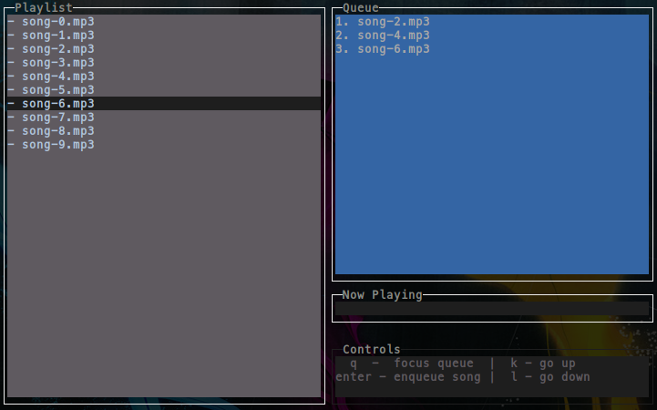
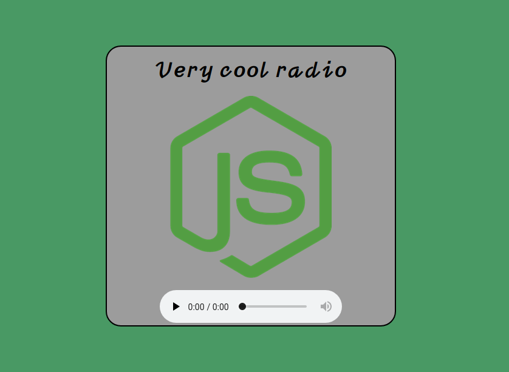

# Node.js radio mini

## Description
This app is a radio streaming solution made entirely in Node.js. It features a terminal gui for the song queue, and an endpoint at which the songs are going to get streamed.

Purpose of the whole project was to have fun and experiment. Production ready radio server should use Shoutcast / Icecast or something similar.

## Usage
When you clone this repository, go into the root and run `npm link`. This will make a `node-radio-mini` command available to be run from anywhere.
Next you need to go into directory that contains music and run the command `node-radio-mini`.

    > node-radio-mini
That command is going to read all mp3 files from current directory and display them on you favourite terminal, similarly like on the image below.

There are four windows. 'Playlist' windows contains all the songs from you current directory. 'Queue' windows contains all queued up and ready to play songs. 'Now playing' windows is showing currently streamed song. 'Controls' window is just a helper for seeing available controls at that point of time.

First song is going to get automatically queued up and played. Song is streamed directly to your speakers, so you can have an idea what is currently playing. Songs are also streamed to the endpoint `process.env.HOST:process.env.PORT/stream`, or if you didn't set any env variables the default would be `localhost:8080/stream`.
If you don't have any songs queued up, the last song will repeat replay.

This app is also serving single html page that will automatically connect to the streaming endpoint shown above. The page is served at `localhost:8080`. You can see how the page appears on the browser in the next screenshot:

### Commands

When the 'playlist' window is focused available commands are:
- q - switch focus to 'queue' window
- k - scroll up in the playlist
- l - scroll down in the playlist
- enter - enqueue selected song

When the 'queue' window is focused available commands are:
- p - switch focus to 'playlist' window
- k - scroll up in the queue
- l - scroll down in the queue
- d - dequeue selected song
- a - move selected song up the queue
- z - move selected song down the queue
